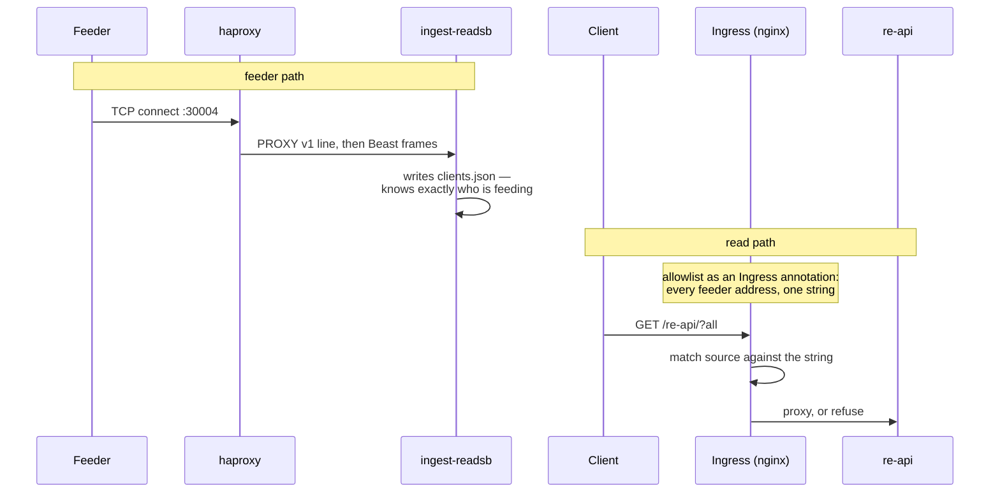
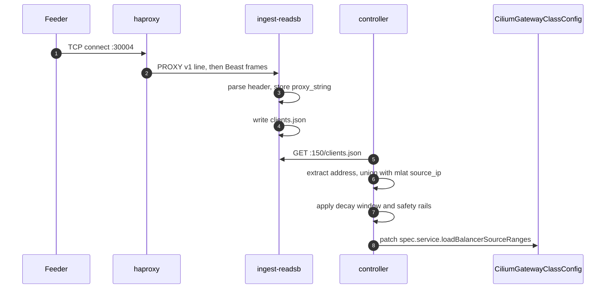
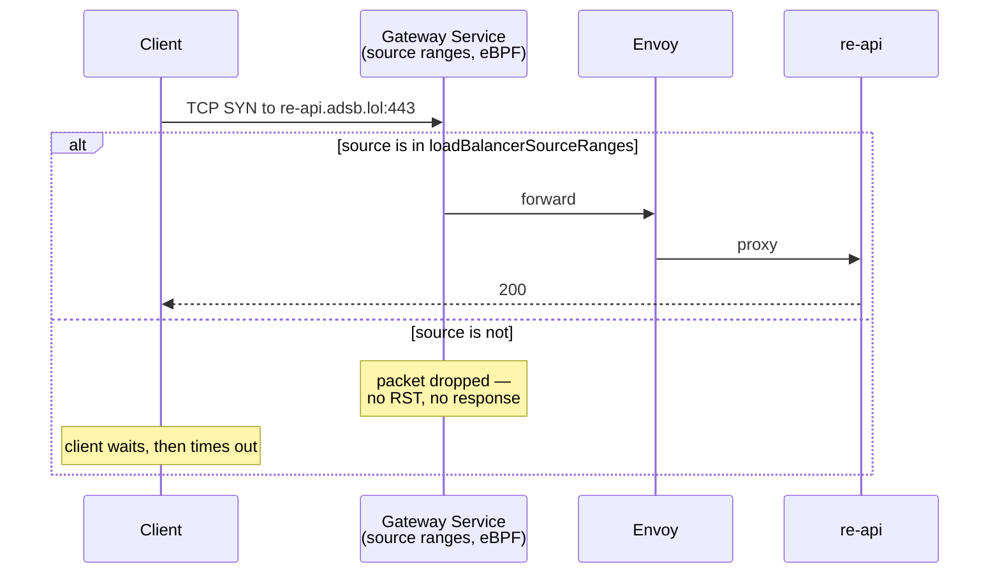
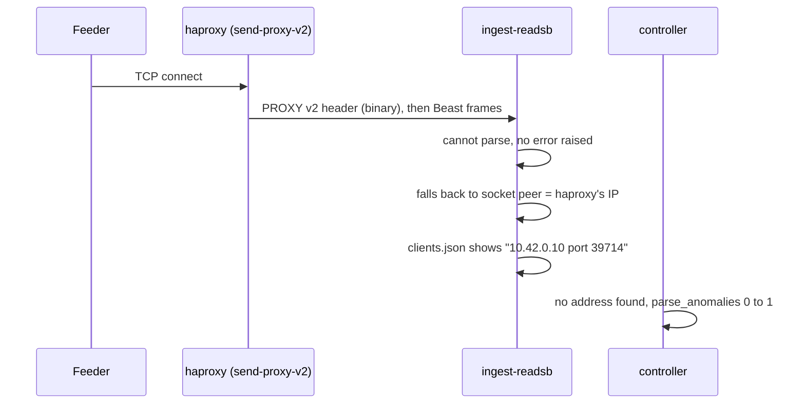

# re-api feeder allowlist — how it works

re-api is meant for people who feed ADSB.lol. That was expressed as an allowlist in an
Ingress annotation, and it stopped working once there were enough feeders.

The proposal keeps the intent and moves where the list lives: a controller derives it
from state readsb and mlat-server already publish, and writes it to the re-api
Gateway's own source ranges.

---

## As designed



The feeder path above already runs. The read path is drawn as intended rather than as
it currently is — see below.

The published intent is that re-api is reachable from *your station's IP address*, so
the allowlist is the set of feeders and has to track them as they come and go. As of
today there are about 5,800 beast and 5,500 MLAT connections, per `api.adsb.lol/metrics`.

The constraint is where that set has to live. An Ingress annotation is a single value,
so the whole list is one string, and ingress-nginx regenerates its config and reloads
when it changes. That is the part that stops scaling, whatever writes the string.

**As of now the annotation is not on the Ingress at all**, and re-api answers anyone who
asks — we checked. So this is not a working control to be replaced; it is an intent that
is currently unenforced.

We have not seen the annotation itself, so its exact form and how it was kept current
are unknown to us.

---

## Proposed

Same intent, different home for the list. Instead of a string on an Ingress, the set
lives in `loadBalancerSourceRanges` on the re-api Gateway's own `CiliumGatewayClassConfig`,
and a controller keeps it in step with who is actually connected. **haproxy, readsb,
mlat-server and the feeder path are unchanged.**

### 1. How an address gets into the allowlist



haproxy adds the PROXY header because readsb needs it to see the real client — without
it readsb records `"<host> port <port>"` and yields no address at all. mlat-server is
more forgiving and falls back to the socket peer.

We have not confirmed directly that ingest receives PROXY v1 today, but the receiver
counts say it must — see the last section.

The controller polls every 60s. An address stays listed for an hour after it was last
seen, so a feeder that reconnects doesn't lose access. Cilium propagates a change from
that object to the Gateway's Service in about five seconds, with no operator restart.

---

### 2. How it's enforced



**A denied client hangs rather than getting a clean refusal.** The packet is dropped in
eBPF before anything speaks HTTP, so there is no 403 and no connection reset — the
client waits for its own timeout. That is the one real cost of this approach and it is
worth deciding on deliberately: a non-feeder gets a hang instead of an answer.

Measured on a lab k3s cluster with one real feeder (a Raspberry Pi) and one bystander.
The second gateway is a control, to show the restriction is scoped to re-api rather than
applying cluster-wide:

| source | re-api gateway | control gateway |
|---|---|---|
| Pi, actively feeding, in the list | **200** | 200 |
| laptop, not feeding, not in the list | **times out — packets dropped** | 200 |

### Why not a network policy

The obvious alternative is a `CiliumClusterwideNetworkPolicy` referencing a
`CiliumCIDRGroup`. It was built and measured too, and it returns a clean 403 instead of
hanging — genuinely nicer behaviour.

It was rejected for a specific reason. A CCNP has no destination match: it cannot say
"this rule applies to re-api." The closest lever is `toPorts`, and `toPorts` matches
**the port the client dialled**, not the port of the service being protected. Every
ADSB.lol endpoint is on 443. So a policy allowing feeders to reach re-api would allow
them to reach every gateway on the cluster, and one denying non-feeders would deny them
everything.

Source ranges scope per GatewayClass instead, so re-api gets its own class and no other
gateway is affected — which is what the control column above is testing.

### Side by side

|  | today | proposed |
|---|---|---|
| how the list is kept current | unknown to us — whatever wrote the annotation | controller polls readsb + mlat every 60s |
| where it lives | one annotation value on an Ingress | source ranges on the re-api Gateway |
| cost of a change | render nginx.conf, reload | one patch, no reload |
| at ~6000 addresses | reported to have stopped working | 6,001 ranges propagate in 178 ms; scaling is sub-linear to 20,000 |
| a feeder that drops briefly | depends on whatever refreshed the annotation | stays listed for a decay window, then ages out |
| a client that is refused | nobody is refused today; the annotation approach would return 403 | connection hangs until the client times out |
| enforcement point | nginx, in the Ingress pod | eBPF, before the connection is accepted |
| feeder path | unchanged | unchanged |

---

## Constraint: readsb parses PROXY v1 only



**This is not something we think is broken today**, and the evidence is in the config
rather than inferred. `manifests/default/haproxy/default/haproxy.cfg` reads:

```
backend mlat
    server mlat mlat-mlat-server:31090 send-proxy

backend beast
    server beast ingest-readsb:30004 send-proxy
```

`send-proxy` emits v1; `send-proxy-v2` would emit v2. Every `bind` in the same file
carries `accept-proxy`, which takes either version. So haproxy accepts both and speaks
v1 onward to readsb, exactly as readsb requires.

One caveat on that evidence: this repo's last substantive commit is 2023-03-28, so it
shows the intent as of then, not proof of what runs today.

We previously argued this from `api.adsb.lol/metrics` — thousands of distinct beast
receivers against fewer connected clients, on the reasoning that a v2 hop would collapse
`receiverId` to roughly one. That argument is weaker than it looked: `receiverId` also
comes from feeder-supplied UUIDs (`--net-receiver-id`), so a high receiver count does not
isolate proxy-string hashing. The config above is the better evidence.

It is a constraint on anything that changes that hop.

readsb looks for the literal text `PROXY ` (`net_io.c`, `readProxy()`); the header
comment says plainly that v2 is not supported. Given a v2 header it does not error — it
does not recognise the signature, does not consume it, and those bytes go into the Beast
decoder before it resyncs. The connection keeps delivering messages, attributed to
whatever proxied it. Measured in a lab: `1.280 messages/s` still flowing, with every
message credited to haproxy's own address.

**haproxy currently normalises this.** `accept-proxy` accepts v1 and v2; `send-proxy`
emits v1. So today a v2 speaker anywhere upstream is quietly translated before readsb
sees it. Anything that replaces haproxy has to preserve that translation, or remove the
need for it by carrying the real client address in the datapath instead.

If it ever does go wrong, readsb logs nothing. The controller's `parse_anomalies` metric
goes non-zero immediately — but so would wrong addresses on the "my" pages and a sudden
collapse in distinct receivers.
